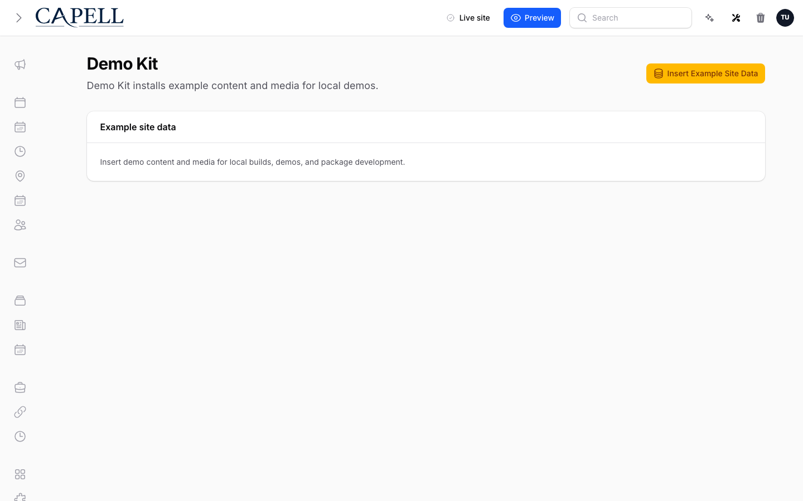
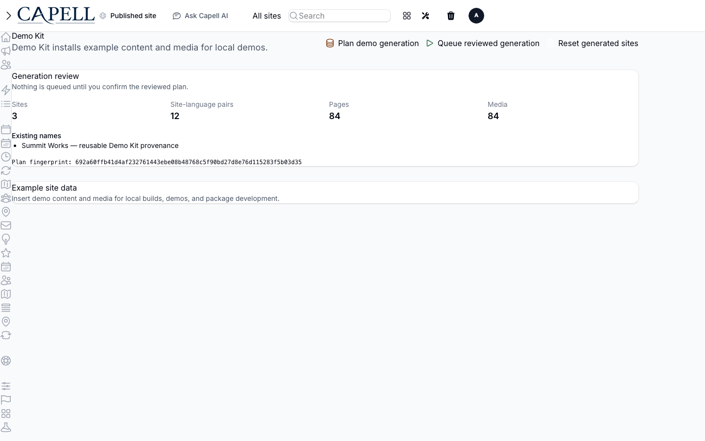

# Demo Kit

<!-- prettier-ignore-start -->

## What This Plugin Adds

Demo Kit is an **Available**, **Schema-owning** Capell package in the **Capell Foundation** product group. It ships as `capell-app/demo-kit` and extends these surfaces: admin, frontend, console.

Demo Kit creates deterministic demo users, sites, languages, pages, media, and package examples from a repeatable generation plan.

Administrators can start demo generation from a package page or console command, then inspect the generated pages and components on the frontend.

Evidence: [`capell.json`](capell.json), [`src/Actions/BuildDemoGenerationPlanAction.php`](src/Actions/BuildDemoGenerationPlanAction.php), [`src/Support/Creator/DemoCreator.php`](src/Support/Creator/DemoCreator.php), [`src/Providers/DemoKitServiceProvider.php`](src/Providers/DemoKitServiceProvider.php), [`docs/overview.admin.md`](docs/overview.admin.md), [`docs/screenshots.json`](docs/screenshots.json), [`src/Filament/Pages/DemoKitPage.php`](src/Filament/Pages/DemoKitPage.php), [`tests/Feature/Commands/FullDemoCommandTest.php`](tests/Feature/Commands/FullDemoCommandTest.php).

Status details:

- Status: Available
- Tier: free
- Bundle: foundation
- Composer package: `capell-app/demo-kit`
- Namespace: `Capell\DemoKit`
- Theme key: not applicable

## Why It Matters

**For developers:** Typed generation plans and package demo command orchestration make local setup, screenshots, and QA data reproducible from a chosen seed.

**For teams:** Teams can evaluate a populated site before entering real content and reset the sample state between demos, with explicit guards against production seeding.

Evidence: [`src/Data/DemoGenerationPlanData.php`](src/Data/DemoGenerationPlanData.php), [`src/Actions/BuildDemoGenerationPlanAction.php`](src/Actions/BuildDemoGenerationPlanAction.php), [`src/Console/Commands/FullDemoCommand.php`](src/Console/Commands/FullDemoCommand.php), [`tests/Unit/Actions/BuildDemoGenerationPlanActionTest.php`](tests/Unit/Actions/BuildDemoGenerationPlanActionTest.php), [`docs/overview.admin.md`](docs/overview.admin.md), [`src/Actions/ResetDemoSitesAction.php`](src/Actions/ResetDemoSitesAction.php), [`src/Console/Commands/Concerns/GuardsAgainstProduction.php`](src/Console/Commands/Concerns/GuardsAgainstProduction.php), [`tests/Feature/Commands/AdminDemoCommandTest.php`](tests/Feature/Commands/AdminDemoCommandTest.php).

## Screens And Workflow

Screenshot contract: `docs/screenshots.json`.

- Demo Kit ready to plan (admin, required evidence).
- Demo Kit ready to plan on mobile (admin, required evidence).
- Recommended generation profile (admin, required evidence).
- Recommended generation profile on mobile (admin, required evidence).
- Custom generation profile (admin, required evidence).
- Custom generation profile on mobile (admin, required evidence).
- Generation review before confirmation (admin, required evidence).
- Generation review before confirmation on mobile (admin, required evidence).
- Review of reusable generated sites (admin, required evidence).
- Review of reusable generated sites on mobile (admin, required evidence).
- Review blocked by ordinary content (admin, required evidence).
- Review blocked by ordinary content on mobile (admin, required evidence).
- Explicit generation confirmation (admin, required evidence).
- Explicit generation confirmation on mobile (admin, required evidence).
- Queued generation (admin, required evidence).
- Queued generation on mobile (admin, required evidence).
- Running generation (admin, required evidence).
- Running generation on mobile (admin, required evidence).
- Completed generation and created content (admin, required evidence).
- Completed generation and created content on mobile (admin, required evidence).
- Failed generation with redacted error (admin, required evidence).
- Failed generation with redacted error on mobile (admin, required evidence).
- Stalled generation requiring a new review (admin, required evidence).
- Stalled generation requiring a new review on mobile (admin, required evidence).
- Provenance-only reset confirmation (admin, required evidence).
- Provenance-only reset confirmation on mobile (admin, required evidence).
- Ordinary content preserved after reset (admin, required evidence).
- Ordinary content preserved after reset on mobile (admin, required evidence).
- Demo Kit with navigation open (admin, required evidence).
- Demo Kit with navigation open on mobile (admin, required evidence).
- Insights consent priming capture (frontend, supplementary evidence).
- Generated demo page content widget (frontend, required evidence).
- Generated homepage section widget (frontend, required evidence).

## Technical Shape

### Service providers

- `Capell\DemoKit\Providers\DemoKitServiceProvider`

### Config files

- `packages/demo-kit/config/capell-demo-kit.php`

### Migrations

- `packages/demo-kit/database/migrations/2026_07_19_130000_create_demo_kit_generation_runs_table.php`
- `packages/demo-kit/database/migrations/2026_09_08_120000_add_review_data_to_demo_kit_generation_runs_table.php`

### Models

- `DemoKitGenerationRun`

### Filament classes

- `HomepageSectionWidgetConfigurator`
- `DemoKitPage`

### Livewire components

- `KitchenSinkStressWidget`
- `ResourcesLibrary`

### Actions

- `BuildDemoGenerationPlanAction`
- `BuildDemoGenerationReviewAction`
- `BuildDemoPageContentViewDataAction`
- `BuildKitchenSinkLayoutWidgetEntriesAction`
- `ConfigureKitchenSinkReferenceWidgetsAction`
- `CreateDemoLanguagesAction`
- `CreateDemoSiteAction`
- `CreateDemoUsersAction`
- `CreateKitchenSinkContextPagesAction`
- `CreateKitchenSinkSourceWidgetsAction`
- `CreateKitchenSinkVariantWidgetsAction`
- `AssertDefaultDemoInstallHealthAction`
- `DemoInstallHealthData`
- `DummyContentGeneratorAction`
- `HasDemoSiteProvenanceAction`
- `InsertExampleSiteDataAction`
- `InstallKitchenSinkDemoPageAction`
- `ListDemoKitProvenanceSitesAction`
- `MarkDemoSiteProvenanceAction`
- `PrepareDemoKitScreenshotFixtureAction`
- `QueueDemoKitGenerationAction`
- `ReclaimStalledDemoKitGenerationRunsAction`
- `RedactDemoKitErrorMessageAction`
- `RefreshDemoStitchPagesAction`
- `ResetDemoKitProvenanceAction`
- `ResetDemoSitesAction`
- `RestoreDemoKitScreenshotFixtureAction`
- `SyncKitchenSinkPageAssetsAction`

### Data objects

- `DemoGenerationPlanData`
- `DemoGenerationReviewData`
- `DemoKitScreenshotFixtureData`
- `DemoPageContentViewData`
- `DemoPagePlanData`
- `DemoProfileData`
- `DemoSiteGenerationPlanData`

### Jobs

- `RunDemoKitGenerationJob`

### Command signatures

- `capell:demo-kit-doctor`
- `capell:demo-kit-full-demo`

### Console command classes

- `AdminDemoCommand`
- `GuardsAgainstProduction`
- `HasLanguagesOption`
- `HasSitesOption`
- `DemoCommand`
- `DemoKitDoctorCommand`
- `DemoKitScreenshotFixtureCommand`
- `FullDemoCommand`
- `KitchenSinkDemoCommand`
- `RefreshDemoStitchPagesCommand`

### Manifest contributions

- `admin-page: Capell\DemoKit\Manifest\DemoKitAdminPageContribution`
- `asset: Capell\DemoKit\Manifest\DemoKitAssetsContribution`
- `configurator: Capell\DemoKit\Manifest\DemoKitConfiguratorContribution`
- `console-command: Capell\DemoKit\Manifest\DemoKitConsoleCommandsContribution`
- `dashboard-widget: Capell\DemoKit\Manifest\DemoKitRenderablesContribution`
- `frontend-component: Capell\DemoKit\Manifest\DemoKitFrontendComponentsContribution`
- `health-check: Capell\DemoKit\Health\DemoKitHealthCheck`

### Health checks

- `Capell\DemoKit\Health\DemoKitHealthCheck`

### Blade views

- `packages/demo-kit/resources/views/components/widget/demo-page-content-assets.blade.php`
- `packages/demo-kit/resources/views/components/widget/demo-page-content.blade.php`
- `packages/demo-kit/resources/views/components/widget/homepage-section.blade.php`
- `packages/demo-kit/resources/views/filament/pages/demo-kit.blade.php`
- `packages/demo-kit/resources/views/livewire/kitchen-sink-stress-widget.blade.php`
- `packages/demo-kit/resources/views/livewire/resources-library.blade.php`

### Cache tags

- `demo-kit`

## Data Model

- Required tables: `capell_demo_kit_generation_runs`.
- Models: `DemoKitGenerationRun`.
- Migration files: `2026_07_19_130000_create_demo_kit_generation_runs_table.php`, `2026_09_08_120000_add_review_data_to_demo_kit_generation_runs_table.php`.
- Migration impact: run host migrations through the package install flow before opening package surfaces.
- Deletion/retention behaviour: Docs gap: migrations and manifest contributions do not prove a cascade, pruning command, or timed retention policy.

## Install Impact

- Required packages: `capell-app/admin`, `capell-app/core`, `capell-app/frontend`, `capell-app/layout-builder`.
- Admin navigation: declares `admin-page: DemoKitAdminPageContribution`; each Filament page or resource controls its own navigation visibility.
- Admin/editor extensions: `configurator: DemoKitConfiguratorContribution`, `dashboard-widget: DemoKitRenderablesContribution`.
- Permissions: Shield-generated page permissions for `Capell\DemoKit\Filament\Pages\DemoKitPage` (names and grants depend on host Shield configuration).
- Public routes: none declared.
- Database changes: package migrations are declared.
- Config: `config/capell-demo-kit.php`.
- Settings: no package settings declared.
- Queues or schedules: queue jobs `RunDemoKitGenerationJob`.
- Cache tags: `demo-kit`.
- Commands: `capell:demo-kit-doctor`, `capell:demo-kit-full-demo`.

## Common Pitfalls

- Keep required Capell packages on compatible v4 releases: `capell-app/admin`, `capell-app/core`, `capell-app/frontend`, `capell-app/layout-builder`.
- Run migrations before opening package resources or public routes.
- Review package configuration before production-like verification: `config/capell-demo-kit.php`.
- Keep public Blade and cached HTML free of authoring markers, model IDs, permissions, signed editor URLs, and lazy database queries.
- Custom write integrations must preserve invalidation for `demo-kit` cache tags.

## Troubleshooting

| Symptom | Likely cause | Check | Fix |
| --- | --- | --- | --- |
| Package health check reports a problem | Package configuration or runtime dependencies are not ready | Run `php artisan capell:demo-kit-doctor` | Follow the reported checks, then rerun the doctor command |
| Package surface is missing after install | Provider or manifest is not loaded | Confirm `capell.json`, package `composer.json`, and provider registration | Reinstall the package, refresh Composer autoload, and clear host caches |
| Admin screen or command fails on missing table | Package migrations have not run | Check the tables listed in `Data Model` | Run host migrations and rerun the focused package test |
| Background work does not run | Queue worker or declared schedule is not active | Check the jobs and scheduled commands listed in `Technical Shape` | Start the queue worker or host scheduler, then run the focused command or package test |
| Public output leaks unexpected state | Render data, cache variation, or authoring boundary has regressed | Check public Blade, cache tags, and public-output safety tests | Move data loading out of Blade and rerun the package public-output tests |

## Quick Start

1. Install the package: `composer require capell-app/demo-kit`.
2. See it working: run `php artisan capell:demo-kit-full-demo`.
3. Open the package admin surface at `/demo-kit` and confirm Demo Kit is available.

## Next Steps

- [Package docs](docs/README.md)
- [Overview](docs/overview.md)
- Configuration files: [`config/capell-demo-kit.php`](config/capell-demo-kit.php).
- [Troubleshooting](#troubleshooting)
- [Screenshot contract](docs/screenshots.json)
- [Marketplace assets](docs/assets/marketplace/)
- [Capell content language plan](../../docs/CONTENT_LANGUAGE_PLAN.md)
- [Capell documentation design system](../../docs/DESIGN_SYSTEM.md)
- [Capell and package ERD notes](../../docs/erd/capell-and-package-erds.md)
- Related packages: [Layout Builder](../layout-builder/README.md).
- Focused tests: `vendor/bin/pest packages/demo-kit/tests --configuration=phpunit.xml`.

<!-- prettier-ignore-end -->
