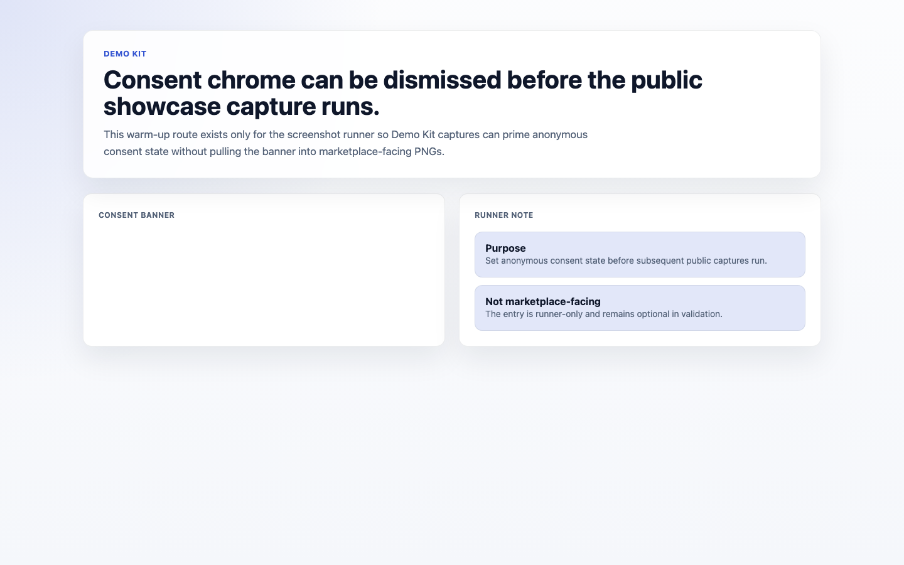
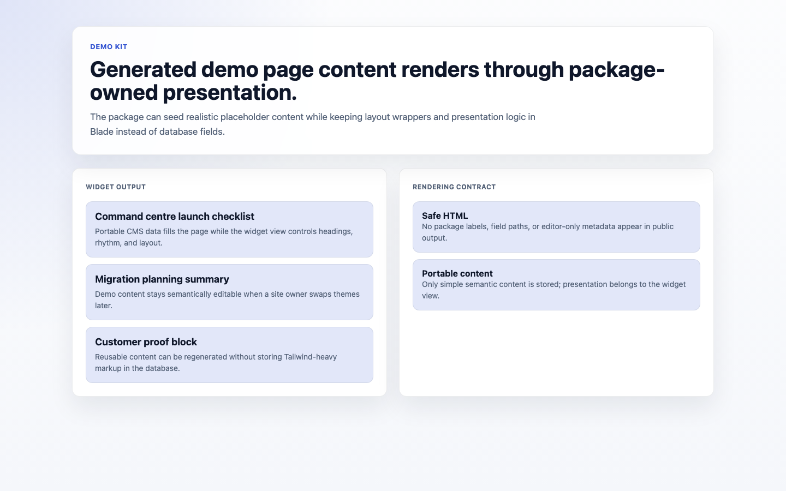
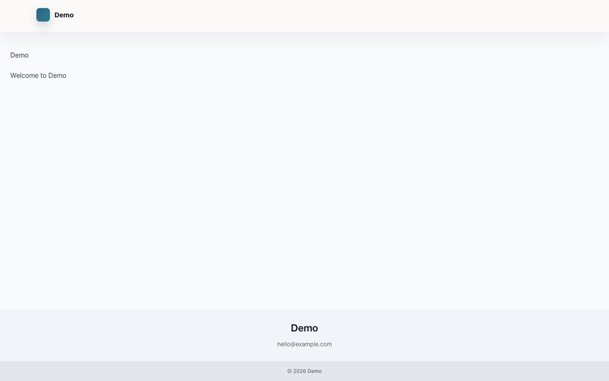

# Demo Kit

<!-- prettier-ignore-start -->

## What This Plugin Adds

Demo Kit is an **Available**, **No schema impact** Capell package in the **Capell Foundation** product group. It ships as `capell-app/demo-kit` and extends these surfaces: admin, frontend, console.

Deterministic demo-data orchestration for Capell - seeds users, sites, languages, pages, media and a Foundation showcase homepage, and dispatches per-package demo commands.

After install, developers and QA teams get console seeding commands, admins get a package-owned management page, and public users may see generated demo content that uses package-owned widget views.

Status details:

- Status: Available
- Tier: free
- Bundle: foundation
- Composer package: `capell-app/demo-kit`
- Namespace: `Capell\DemoKit`
- Theme key: not applicable

## Why It Matters

**For developers:** The package gives developers package-owned service providers, Actions, Data objects, Filament classes, and Blade views instead of pushing this behaviour into core or application code.

**For teams:** The demo engine for Capell: deterministic, multi-site, multi-language sample content and media. Generates a curated showcase site, fans out to each installed package's own demo command, and ships a health doctor so every demo, screenshot, and QA run starts from known data.

## Screens And Workflow

Screenshot contract: `screenshots.json`.

- Demo Kit admin page (admin, required).
- Insights consent priming capture (frontend, optional).
- Generated demo page content widget (frontend, required).
- Generated homepage section widget (frontend, required).

## Screenshot Evidence

These captures are the package-owned visual contract for the admin pages, public pages, actions, workflows, and feature surfaces described above. Keep this section aligned with `docs/screenshots.json` whenever the package surface changes.

### Demo Kit admin page

- Surface: admin · Target: DemoKitPage.
- Documents: An administrator starts deterministic demo content generation from the package-owned admin page.
- Capture notes: Capture as an admin who can manage extensions, with the Insert example site data header action available. Opening the action modal is useful when the runner supports modal state.

### Insights consent priming capture

- Surface: frontend · Target: capell-demo-kit::components.widget.demo-page-content.
- Documents: The screenshot runner sets anonymous visitor consent state so public Demo Kit captures do not include analytics consent chrome.
- Capture notes: Runner-only warm-up capture that dismisses the Insights consent banner before marketplace-facing public screenshots are taken.

### Generated demo page content widget

- Surface: frontend · Target: capell-demo-kit::components.widget.demo-page-content.
- Documents: A maintainer verifies generated demo pages render designed content through the package-owned Blade view.
- Capture notes: Requires Demo Kit generated page data with a layout widget using the demo-page-content renderable. Public output should show package Blade presentation, not stored Tailwind markup from database content.

### Generated homepage section widget

- Surface: frontend · Target: capell-demo-kit::components.widget.homepage-section.
- Documents: A maintainer checks the generated homepage uses portable CMS data with presentation kept in package Blade.
- Capture notes: Requires a generated homepage layout that includes a homepage-section renderable such as the command-centre hero widget.

## Technical Shape

- Service providers: `Capell\DemoKit\Providers\DemoKitServiceProvider`.
- Config files: `packages/demo-kit/config/capell-demo-kit.php`.
- Filament classes: `HomepageSectionWidgetConfigurator`, `DemoKitPage`.
- Livewire components: `KitchenSinkStressWidget`, `ResourcesLibrary`.
- Actions: `BuildDemoGenerationPlanAction`, `BuildDemoPageContentViewDataAction`, `CreateDemoLanguagesAction`, `CreateDemoUsersAction`, `AssertDefaultDemoInstallHealthAction`, `DemoInstallHealthData`, `DummyContentGeneratorAction`, `InsertExampleSiteDataAction`, `InstallKitchenSinkDemoPageAction`, `RedactDemoKitErrorMessageAction`, `RefreshDemoStitchPagesAction`, `ResetDemoSitesAction`.
- Data objects: `DemoGenerationPlanData`, `DemoPageContentViewData`, `DemoPagePlanData`, `DemoProfileData`, `DemoSiteGenerationPlanData`.
- Manifest contributions: admin page, homepage widget configurator, frontend assets, Livewire/demo payload components, layout widget renderables, console commands, and health check.
- Command signatures: `capell:demo`, `capell:admin-demo`, `capell:demo-kit-full-demo`, `capell:demo-kit-doctor`, `capell:demo-kit-refresh-stitch-pages`, `capell:kitchen-sink-demo`.
- Console command classes: `AdminDemoCommand`, `GuardsAgainstProduction`, `HasLanguagesOption`, `HasSitesOption`, `DemoCommand`, `DemoKitDoctorCommand`, `FullDemoCommand`, `KitchenSinkDemoCommand`, `RefreshDemoStitchPagesCommand`.
- Health checks: `Capell\DemoKit\Health\DemoKitHealthCheck`.
- Blade views: `packages/demo-kit/resources/views/components/widget/demo-page-content-assets.blade.php`, `packages/demo-kit/resources/views/components/widget/demo-page-content.blade.php`, `packages/demo-kit/resources/views/components/widget/homepage-section.blade.php`, `packages/demo-kit/resources/views/filament/pages/demo-kit.blade.php`, `packages/demo-kit/resources/views/livewire/kitchen-sink-stress-widget.blade.php`, `packages/demo-kit/resources/views/livewire/resources-library.blade.php`.
- Cache tags: `demo-kit`.

## Data Model

This package has no schema impact. It does not declare package-owned migrations or required tables.

Demo Kit delegates persistence to Capell Core/Admin/Frontend models and Layout Builder widgets. Its package-owned extension points are command orchestration, manifest-declared admin/frontend surfaces, renderable widget views, runtime assets, and the diagnostics health contract.

## Install Impact

- Admin navigation: adds package-owned Filament classes when registered.
- Permissions: none declared in `capell.json`.
- Public routes: none detected in package route files.
- Database changes: no package migrations declared.
- Settings: no package settings declared.
- Queues or schedules: none detected in standard package paths.
- Cache tags: `demo-kit`.
- Commands: `capell:demo`, `capell:admin-demo`, `capell:demo-kit-full-demo`, `capell:demo-kit-doctor`, `capell:demo-kit-refresh-stitch-pages`, `capell:kitchen-sink-demo`.

## Commands

| Command | Role |
| --- | --- |
| `capell:demo-kit-full-demo` | Canonical entry point. Builds the deterministic site/language/page plan, runs admin seeding, fans out to package demos, and installs the Kitchen Sink reference page. |
| `capell:admin-demo` | Seeds core/admin demo data: users, languages, sites, pages, media, and the Foundation showcase homepage. |
| `capell:demo` | Fan-out runner for installed packages that declare `commands.demo` in `capell.json`; forwards only parameters each package declares. |
| `capell:demo-kit-doctor` | Runs Demo Kit health checks for showcase widgets, media, assets, package capabilities, cache eligibility, and public render safety. |
| `capell:demo-kit-refresh-stitch-pages` | Refreshes generated Stitch demo page assets used by the Demo Kit workflow. |
| `capell:kitchen-sink-demo` | Installs or refreshes the Kitchen Sink stress page for public rendering coverage. |

The canonical demo parameters are `url`, `user`, `languages`, `sites`, `site-count`, `page-count`, `packages`, `theme`, `seed`, `quick`, `reset`, `skip-demo-users`, `allow-production`, and `force`.

## Common Pitfalls

- Keep public Blade and cached HTML free of authoring markers, model IDs, permissions, signed editor URLs, and lazy database queries.
- Keep `composer.json`, `composer.local.json`, `capell.json`, docs, screenshots, and tests aligned when the package surface changes.

## Troubleshooting

| Symptom | Likely cause | Check | Fix |
| --- | --- | --- | --- |
| Package surface is missing after install | Provider or manifest is not loaded | Confirm `capell.json`, package `composer.json`, and provider registration | Reinstall the package, refresh Composer autoload, and clear host caches |
| Background work does not run | Queue worker or scheduled command is not active | Check package jobs, commands, and host scheduler configuration | Start the queue or scheduler, then run the focused command or package test |
| Public output leaks unexpected state | Render data, cache variation, or authoring boundary has regressed | Check public Blade, cache tags, and public-output safety tests | Move data loading out of Blade and rerun the package public-output tests |

## Quick Start

1. Install the package: `composer require capell-app/demo-kit`.
2. Run the required setup: `php artisan capell:demo-kit-full-demo`.
3. Open the related Capell admin surface and verify Demo Kit appears.

## Next Steps

- [Package docs index](README.md)
- [Screenshot contract](screenshots.json)
- [Marketplace assets](assets/marketplace/)
- [Capell content language plan](../../../docs/CONTENT_LANGUAGE_PLAN.md)
- [Capell documentation design system](../../../docs/DESIGN_SYSTEM.md)
- [Capell and package ERD notes](../../../docs/erd/capell-and-package-erds.md)
- Focused tests: `vendor/bin/pest packages/demo-kit/tests --configuration=phpunit.xml`.

<!-- prettier-ignore-end -->
